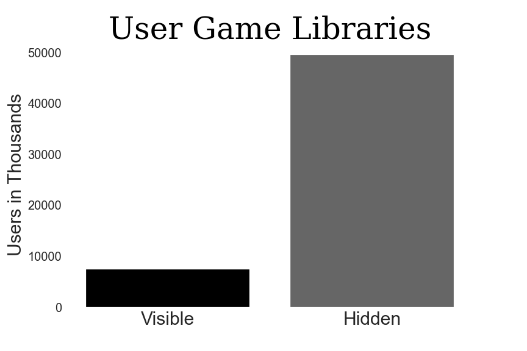

# Steam Rek System
Author: Chris O'Malley

##  Overview
The goal of this project was to build a collaborative recommendation system for Steam using user game libraries. A profile was built for each user using the hours they spent playing different kinds of games, and recommendations are given to a user based off users with similar profiles. By basing recommendations on hours played rather than games purchased the aim is to find more engaging games for users to keep them interested in gaming in lieu of other pastimes.

## Business Understanding
Steam already has it's own recommendation system, the Discovery Que. It is based on previously purchased games and incorporates new and popular games. The Steam interactive Recommender was also released in 2020, which uses machine learning to provide recommendations based on games played and users that have played those same games. It has a tag filtering system and can be filtered for popularity and release date. My recommendation system isn't meant to replace those systems as much as to show an alternative process that I believe would be a good addition to the above system. Though purchases are understandably a high priority for any company, I think that being the only focus is short-sighted. I believe keeping users engaged will ultimately keep them gaming, on the platform, and purchasing more games.

## Data Understanding
There were two main datasets used for this project, a game dataset and a user dataset, scraped or requested from various sources. It should be noted that I used https://nik-davis.github.io/posts/2019/steam-data-collection/, a post from Nik Davis, as a basis for much of my scraping methods. While I could mostly copy, paste, and run code for the game dataset with minor adjustments, I had to make major changes to adapt it for my user library requests. I will go into more detail below.

Game dataset:
Comprised of app ids, titles, genres, and tags.

Appids: The appids of the 1,000 most owned games were requested from the SteamSpy.com API. Unfortunately there were some changes to the API in recent years and I was not able to request every game title at once, limiting me to the first thousand most owned games. My attempts to run multiple requests per SteamSpy API documentation did not work, so I must acknowledge there is some bias towards games with more owners in this recommendation system. Nik Davis's code was used for this portion, however it was a bit dated in the regard that SteamSpy started limiting the 'all' request for it's API. I could not adapt it to gather the full steam library. However, a decent system can be built as the 1,000 games were the most owned, with the understanding that it won't be perfect.

Titles, genres, tags: The appids acquired from SteamSpy API were used to request additional data from the Steam API, consisting of game titles, genres and tags. This was again copied from Nik Davis's code and worked smoothly with minor adjustment.

The above data was combined into the game_data dataset.

User dataset
Comprised of steamids and game libraries.

Steamids: Firstly the appids of the 1,000 top rated and 1,000 most followed games were scrapped from Steamdb.com using Selenium. Those appids were then used to scrape up to 100 steamids from the most recent reviews of each of those games on Steampowered.com. This was done both to have relevant/active users as well as gather a sampling from different types of games. This ultimately ended with around 60,000 steamids.

Game libraries: Game libraries were requested from the Steam API. I was able to adapt the code from Nik for this purpose with major changes. Steam API has a spam limit that had to be accounted for, as well as needing to create extra helper functions to deal with the errors. Request retries needed to be removed because if a request failed, it was likely because a steamid was no longer valid. The return format also proved to be an issue. However all issues were eventually resolved with adjustments.

The above data was combined into the library_df dataset.

The api requests and scraping for the game dataset and user libraries can be found in data/data_harvest. Scrapoing for user ids with Selenium can be in the assorted Python files in the data folder as well.


## Technical Understanding
Of the 57,000 user libraries, around 50,000 were hidden. After dropping duplicates and users with 0 hours played there were 5,500 users left. Though at least 10,000 users would have been preferable, 5,500 was enough to build a relatively accurate model.



The recommendation system created here uses an hours-by-tag personalized rating system. Each game in a user's library has a community-voted list of tags associated with it. A profile was built for each of user based on the total number of hours played by tag. By normalizing these hours, we get a value between 0 and 1 that correlates with the percentage of time spent playing games with said tag. For each game in the user's library we added the above values for each tag associated with it to score it. Every game in the user library ended up with a score between 0 and 1, which was then used in the collaborative recommendation system to find users with similar rating profiles.

From the Python Surprise Library I used SVD, KNNWtihMeans, KNNBasic and KNNBaseline to model my data. They are standard starting points and are not extremely computationally expensive. RMSE was used as the metric to score the model as it easy to interpret(being on the same scale as the ratings) and it is standard use for a collaborative recommendation system. KNNBaseline scored best out of the three with default parameters and cross-validationk, though KNNBasic was close. After running grid searches with SVD, KNNBasic and KNNBaseline the chosen model was KNNBasic. The hyperparameters used were K=10 with similarity options of MSD, min_support=5, and user_based=True. The RMSE of the final model was .037 for a rating scale of 0 to 1.

## Methods

### First Simple Model
SVD with no parameters achieved an RMSE of .06. Being on a scale of 0-1 this wasn't bad, but there were improvements that could be made.

### KNNBasic vs KNNBaseline
Both scored well in inital modeling with mean RMSE's of around .05 after cross validation.

### Final Model
After running the chosen models through Grid Search, KNNBasic was chosen as the final model. Though KNNBasic and KNNBaseline scored similarly throughout the modeling stages, KNNBasic was more computationally efficient.

## Evaluation
As mentioned above the final model is KNNBasic. The hyperparameters used were K=10 with similarity options of MSD, min_support=5, and user_based=True. With an RMSE of .037 in a 0-1 rating system we can be reasonably confident in our predictions. It is easy to interpret our results as it is on the same scale as the rating system.

## Conclusion
All in all it the recommendation system created here isn't bad, though there are some issues that would prevent me from deploying it. Firstly it is currently working off of the 1,000 most owned games on Steam due to some scraping limitation. Though this does cover the majority of user game libraries, it does have a bias towards more popular games. There is also the cold start issue inherit in collaborative filtering, wherein user's without much or any hours played may not get proper recommendations and would be better off using something like a popularity recommendation system. Finally I found out pretty late in the process that there was defined difference between 'explicit' and 'implicit' rating systems. Explicit would be using defined user ratings, and implicit would be implying the ratings from other metrics, like what I did here with the user-tag hours. Unfortunately that means that there are other metrics that I should be using to judge my models here, such as Mean Average Precision at K (MAPK, MAP@K). However at this stage I will have to settle on the results here, and perhaps get some more reliable results at a later stage. I think there is some value to be drawn from the rating system I implemented here and will likely employ it again in the future to similar projects.

### For More Information
Please review the full analysis [Jupyter Notebook](./Steam_Rek_System.ipynb)

or [Presentation](./Steam_Rek_System.pdf)


### Repository Structure

```
├── data
│   ├── app_list.csv
│   ├── big_rating_df.pickle
│   ├── data_harvest.ipynb
│   ├── library_data.csv
│   ├── library_index.txt
│   ├── mfui.pickle
│   ├── modded_library_df.pickle
│   ├── most_followed_games_users.py
│   ├── most_played_games_users.py
│   ├── mpui.pickle
│   ├── steamid_list.pickle
│   ├── steamspy_data.csv
│   ├── steamspy_index.txt
│   ├── top_rated_games.py
│   ├── top_rated_games_users.py
│   ├── top_rated_user_libraries_fifty.pickle
│   ├── top_rated_user_libraries_hundred.pickle
│   ├── trial_api_request.py
│   └── trui.pickle
├── images
│   ├── hidden.png
│   └── steam_bg.jpg
├── jupyters
│   ├── .ipynb_checkpoints
│   └── workspace.ipynb
├── .gitignore
├── Steam_Rek_System.pdf
├── Steam_Rek_System.ipynb
└── README.md
